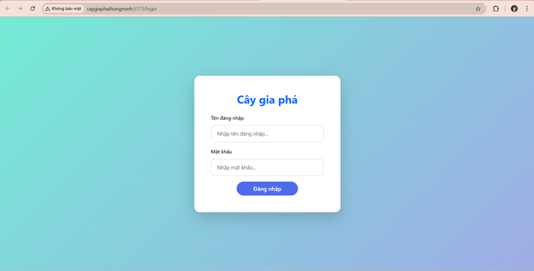
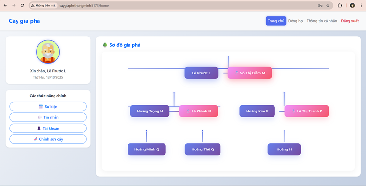
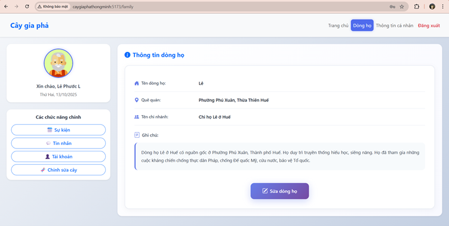
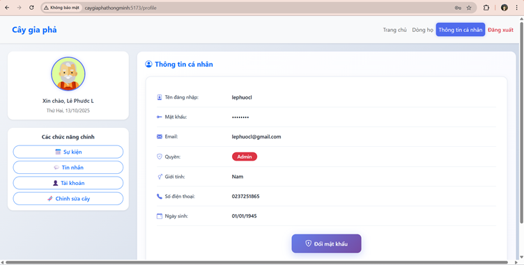
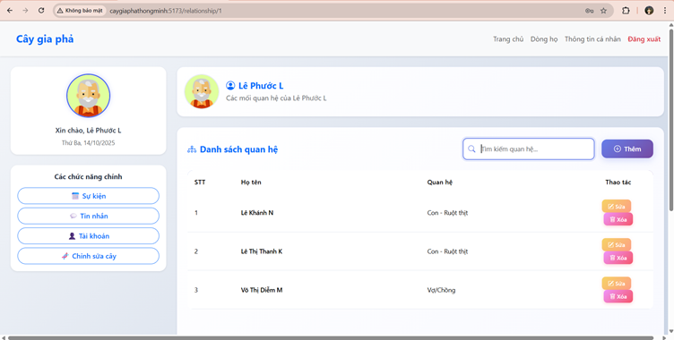
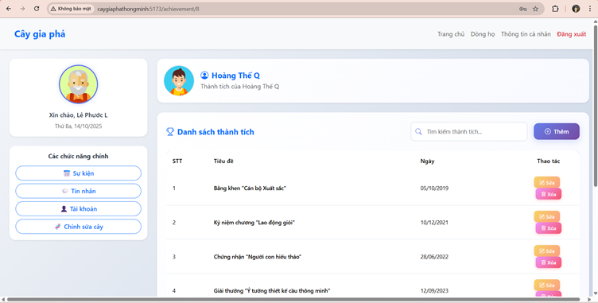
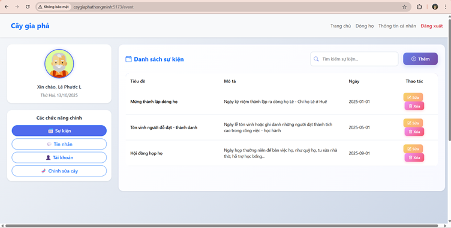
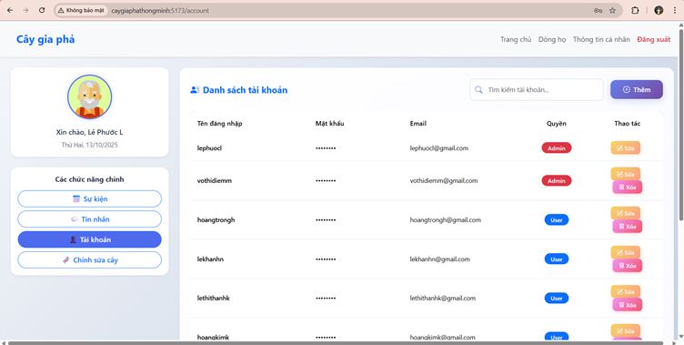
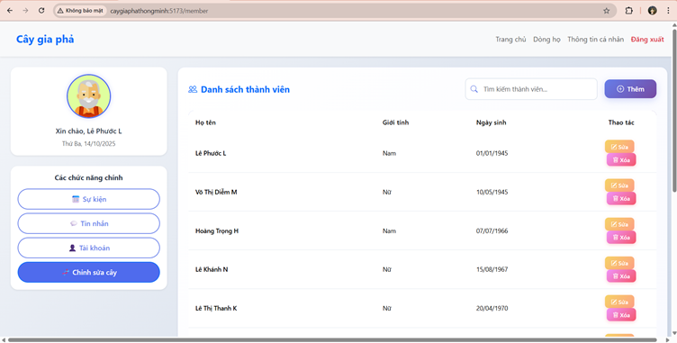
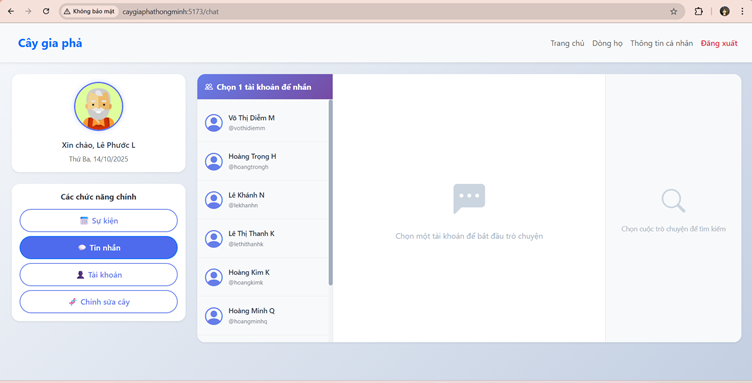

# website-caygiapha
- Nhóm sinh viên thực hiện:
1. 22T1020362 - Nguyễn Thế Quang
2. 22T1020340 - Võ Minh Quân
3. 22T1020749 - Hoàng Trọng Hiếu
4. 22T1020606 - Lê Phước Thiên
- Lớp: Phần mềm mã nguồn mở - Nhóm 4 
- Giảng viên hướng dẫn: TS. Hồ Quốc Dũng 

# Mục lục

- [website-caygiapha](#website-caygiapha)
- [Mục lục](#mục-lục)
- [Tính năng](#tính-năng)
- [Ảnh chụp giao diện người dùng](#ảnh-chụp-giao-diện-người-dùng)
  - [Trên Desktop](#trên-desktop)
- [Cách cài đặt (Windows 11)](#cách-cài-đặt-windows-11)
- [Bảng theo dõi tiến độ](#bảng-theo-dõi-tiến-độ)
- [Dự định tương lai](#dự-định-tương-lai)

# Tính năng
- Website hiển thị cây gia phả với các tính năng:
+ Phát triển một Website hỗ trợ quản lý, lưu trữ và hiển thị thông tin cây gia phả trực quan.
+ Đăng nhập, đăng xuất.
+ Hiển thị thông tin người dùng và đổi mật khẩu.
+ Hiển thị thông tin về dòng họ.
+ Thêm, sửa, xóa, tìm kiếm, xem danh sách tài khoản, sự kiện, quan hệ, thành tích, thành viên trong dòng họ.
+ Nhắn tin giữa các tài khoản của các thành viên trong dòng họ.
+ Góp phần bảo tồn và phát huy giá trị truyền thống văn hóa Việt Nam, tăng cường sự kết nối giữa các thành viên trong gia đình, dòng họ.

# Ảnh chụp giao diện người dùng
## Trên Desktop
| Đăng nhập                         || Trang chủ                       |
| ----------------------------------|-| -------------------------------|
|  ||  | 

| Dòng họ                             || Thông tin cá nhân                     |
| ------------------------------------|-| -------------------------------------|
|  ||  | 

| Quan hệ                                        || Thành tích                                    |
| -----------------------------------------------|-| ---------------------------------------------|
|  ||  |

| Sự kiện                             || Tài khoản                             |
| ------------------------------------|-| -------------------------------------|
|    ||  | 

| Thành viên                             || Nhắn tin                        |
| ---------------------------------------|-| -------------------------------|
|     ||  | 

# Cách cài đặt (Windows 11)
- Cài: ReactJS, CodeIgniter 4, MySQL, VS Code
- Bước 1: Tải file zip trên link github về.
- Bước 2: Giải nén file Zip trong thư mục nào đó trên máy.
- Bước 3: Mở phần trong file zip trong VS Code.
- Bước 4: Mở notepad với quyền Administrator, mở C:\Windows\System32\drivers\etc -> mở file hosts trong notepad. Thêm dòng:
` 127.0.0.1  	    caygiaphathongminh `
- Bước 5: Tạo 2 terminal
+ 1 terminal: cd caygiapha_backend -> php spark serve
+ 1 terminal: cd caygiapha_frontend -> npm run dev
- Bước 6: Mở đường link: http://caygiaphathongminh:5173/ để hiển thị trang web.

# Bảng theo dõi tiến độ

| Ngày                  | Công việc                                                                                          | Ghi chú                |
| --------------------- | -------------------------------------------------------------------------------------------------- | ---------------------- |
| 03-10/10/2025         | Khởi tạo dự án; Phân tích thiết kế cây gia phả (Use Case, Giao diện, Dữ liệu)                      | UML, Balsamiq, MySQL   |
| 11-14/10/2025         | Hoàn thiện CSDL                                                                                    | MySQL                  |
| 15-22/10/2025         | Làm backend, kết nối CSDL                                                                          | CodeIgniter 4, MySQL   |
| 23-29/10/2025         | Làm Frontend, kết nối backend và frontedn                                                          | ReactJS, CodeIgniter 4 |
| 30/10-06/111/2025     | Viết File Word báo cáo đồ án, cập nhật Readme.md                                                   | Docx                   |

# Dự định tương lai
- [ ] Cập nhật cấu trúc Website, làm tối ưu và làm sạch code.
- [ ] Tối ưu cấu trúc cơ sở dữ liệu của Website.
- [ ] UI : Thiết kế giao diện đẹp hơn.